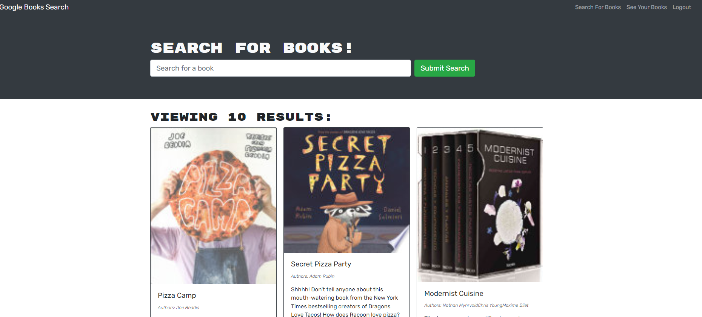
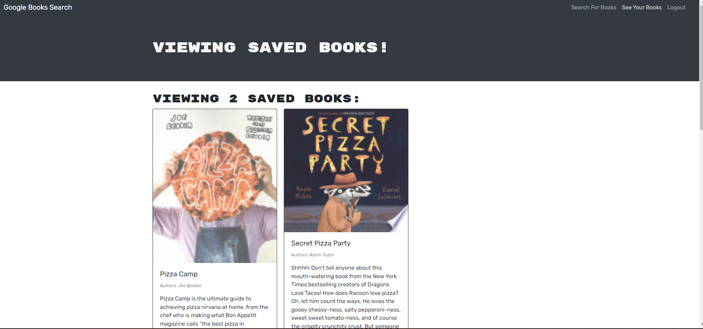

<h1 align="center">Book Search Engine </h1>

---

# Description

# Description

Book Search Engine web application is a web site that allows the user to search for books and save the books as favorites to their user profile page. The user can add and remove saved books. 

The application is build using Graphql implementation for the database and fetch endpoints. It also uses an external fetch api from google books.

The application consist of a client side and the server side

# Table of Contents

[Installation](#installation)

[Usage](#usage)

[Technologies](#technologies)

[Contribution](#contribution)

[Tests](#test)

[Questions](#questions)

[License](#license)

# Installation

1. First have Node.js installed
2. clone the repo and in your terminal type `git clone https://github.com/SophoanMeas/book-search-engine.git`
3. type `npm install` to install all the node dependencies for this project
4. type `npm run start:dev` to launch the application locally

# Usage
### Application

* <a href="https://book-search-engine-pon.herokuapp.com/" target="_blank"><h4> *Bugdget Tracker*</a>
# Technologies
Server Side
* apollo server
* express.js
* graphql - database storage
* mongoose
* bcrypt

Client Side

* apollo client
* graphql
* react-dom
* react-router-dom

Style
* bootstrap

# Contribution

N/A

# Test

N/A
# Questions

---

<h1 align="center">Contact Me</h1>

Check out my Github for more projects

Have a question? Feel free to drop me an email.

📧[sophoan.meas@hotmail.com](mailto:sophoan.meas@hotmail.com)

---
# License

#### Copyright© [sophoanMeas](https://github.com/sophoanMeas). All rights reserved.
#### Licensed under *GNU*

---
## Screenshot

